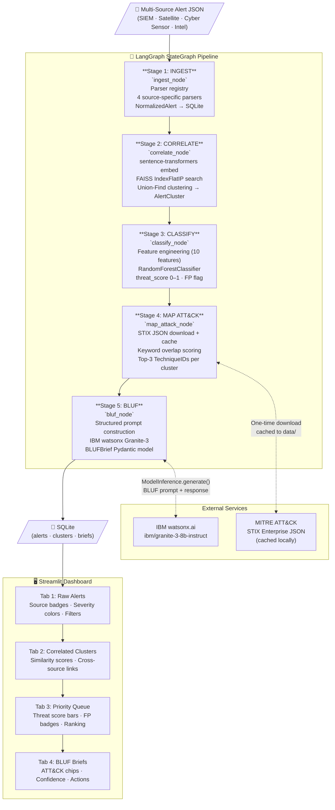

# Architecture — ThreatLens AI

## Pipeline Overview

ThreatLens AI is a five-stage LangGraph pipeline. Each stage is a stateful graph node that receives and updates a shared `PipelineStateDict`. Data flows from raw multi-format alerts to commander-ready BLUF intelligence briefs.

---

## Mermaid Diagram



---

## Component Table

| Component | Technology | Purpose | File |
|---|---|---|---|
| **Orchestrator** | LangGraph 0.2+ StateGraph | Wires 5 pipeline nodes, manages shared state | `src/pipeline/graph.py` |
| **Schema** | Pydantic v2 | Type-safe data models across all stages | `src/schema.py` |
| **Persistence** | SQLAlchemy + SQLite | Alert, cluster, brief storage with WAL mode | `src/db.py` |
| **Data Generator** | Python stdlib + random | Seeded synthetic defense alerts (4 formats) | `src/data/generate_alerts.py` |
| **Ingest Stage** | Parser registry pattern | 4 source parsers → NormalizedAlert | `src/pipeline/ingest.py` |
| **Correlation Stage** | sentence-transformers + FAISS + Union-Find | Semantic similarity clustering | `src/pipeline/correlate.py` |
| **Classification Stage** | scikit-learn RandomForest + joblib | Threat vs. FP scoring per cluster | `src/pipeline/classify.py` |
| **ATT&CK Mapping Stage** | mitreattack-python + STIX JSON | Technique ID mapping from cluster text | `src/pipeline/map_attack.py` |
| **BLUF Stage** | ibm-watsonx-ai SDK + Granite-3 | Commander-ready intelligence brief generation | `src/pipeline/bluf.py` |
| **Dashboard** | Streamlit + Plotly | 4-tab real-time visualization UI | `src/app.py` |
| **CLI** | argparse | End-to-end pipeline runner with verification | `src/run_pipeline.py` |

---

## Data Flow

```
RawAlert (JSON)
  │
  ▼  [ingest]
NormalizedAlert
  {id, source_type, severity, timestamp, raw_text, source_ip, actor, cve_ids, ...}
  │
  ▼  [correlate]
AlertCluster
  {cluster_id, alert_ids[], source_types[], max_severity, avg_similarity, combined_text}
  │
  ▼  [classify]
AlertCluster + threat_score (0–1) + is_false_positive
  │
  ▼  [map_attack]
AlertCluster + attack_techniques[] [{technique_id, name, tactic, match_score}]
  │
  ▼  [bluf]
BLUFBrief
  {bottom_line, confidence, supporting_detail, techniques_summary, recommended_action}
```

---

## IBM Bob Integration Detail

```
Cluster metadata
     │
     ▼
_build_prompt(cluster)
     │  ┌─────────────────────────────────────────────────────────┐
     │  │  You are a senior cyber-defense analyst...              │
     │  │  Alert Sources: SIEM, CYBER_SENSOR                      │
     │  │  Severity: CRITICAL  Threat Score: 87%                  │
     │  │  ATT&CK: T1078 (Valid Accounts), T1048 (Exfiltration)  │
     │  │  Combined summary: [alert text...]                      │
     │  │  Produce: BOTTOM_LINE / CONFIDENCE / SUPPORTING_DETAIL  │
     │  │  TECHNIQUES_SUMMARY / RECOMMENDED_ACTION / CLASSIF.     │
     │  └─────────────────────────────────────────────────────────┘
     │
     ▼
ibm_watsonx_ai.ModelInference.generate()
  model_id = "ibm/granite-3-8b-instruct"
  max_new_tokens = 512, temperature = 0.3
     │
     ▼
_parse_response(text)
  → regex extraction of 6 BLUF fields
     │
     ▼
BLUFBrief (Pydantic) → SQLite → Streamlit BLUF card
```

---

## Deployment Architecture

```
┌─────────────────────────────────────────────────────────┐
│  Local Machine (Hackathon Demo)                         │
│                                                         │
│  ┌─────────────────┐    ┌──────────────────────────┐   │
│  │  CLI Pipeline   │    │  Streamlit Dashboard      │   │
│  │  run_pipeline.py│    │  src/app.py               │   │
│  │  (batch mode)   │    │  localhost:8501           │   │
│  └────────┬────────┘    └──────────┬───────────────┘   │
│           │                        │                    │
│           └──────────┬─────────────┘                    │
│                      │                                  │
│              ┌───────▼────────┐                         │
│              │  SQLite DB     │                         │
│              │  data/*.db     │                         │
│              └────────────────┘                         │
│                                                         │
│  External calls (HTTPS):                                │
│  • IBM watsonx.ai (BLUF generation, Stage 5)           │
│  • MITRE GitHub (ATT&CK STIX, one-time download)       │
└─────────────────────────────────────────────────────────┘
```
